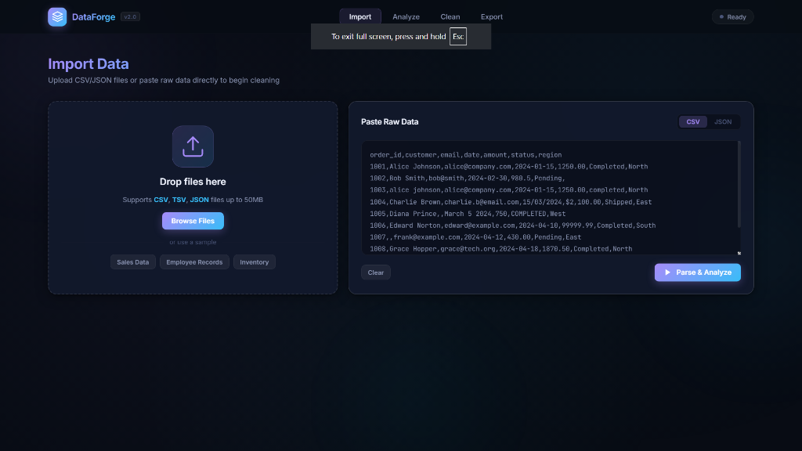
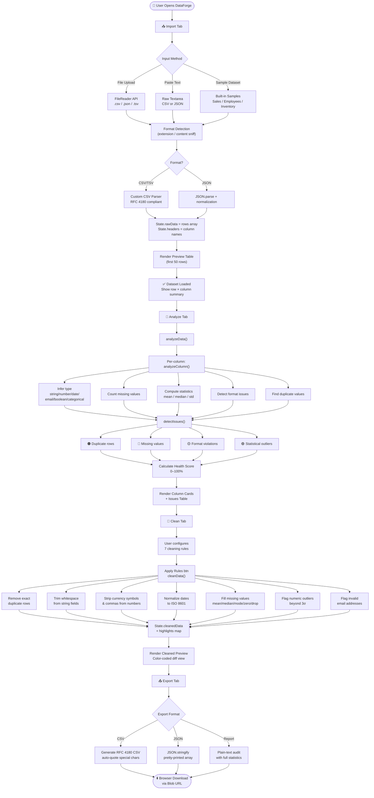
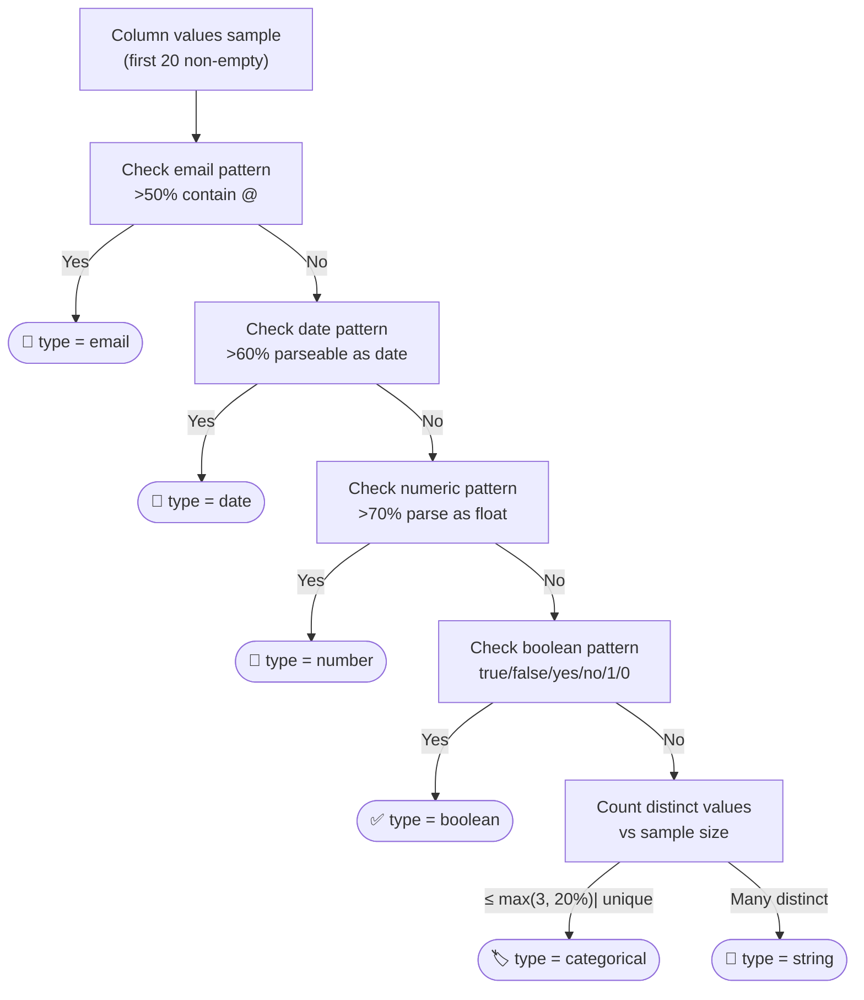
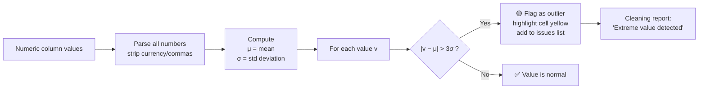
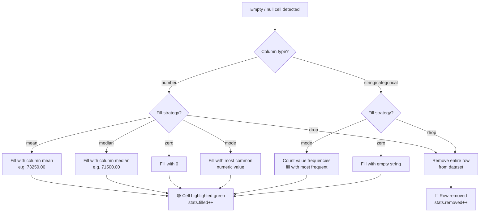
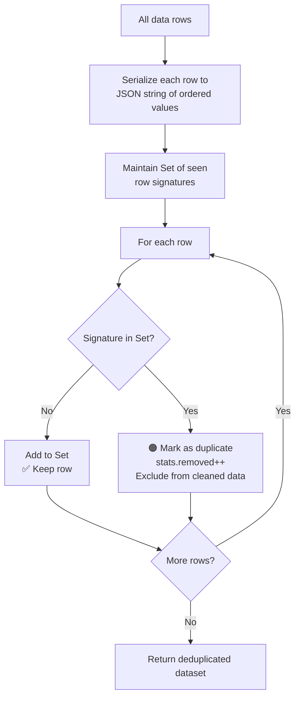
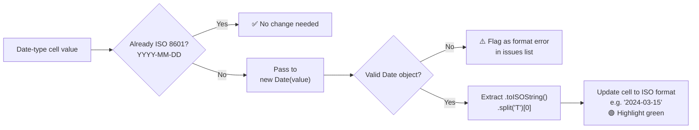

<div align="center">

<!-- ═══════════════════════════════════════════════════════════ -->
<!--                     HERO BANNER                           -->
<!-- ═══════════════════════════════════════════════════════════ -->


<br/>

# ⚗️ DataForge

### *Transform Raw, Messy Data Into Analysis-Ready Gold*

**A zero-dependency, browser-native Data Cleaning & Structural Validation tool —**  
**built with pure HTML5, CSS3, and Vanilla JavaScript.**

<br/>

[](https://dataforge-kohl.vercel.app/)
[](https://github.com/your-username/dataforge)
[](https://github.com/your-username/dataforge/releases)
[](./LICENSE)
[](#tech-stack)

<br/>

</div>

---

## 📋 Table of Contents

| Section | Description |
|---------|-------------|
| [✨ Overview](#-overview) | What DataForge is and why it matters |
| [🎬 Live Screenshots](#-live-screenshots) | Real screenshots of every tab |
| [🗺️ How It Works](#️-how-it-works) | Full pipeline walkthrough |
| [🔄 Flowcharts](#-flowcharts) | Data flow & architecture diagrams |
| [🧹 Cleaning Rules](#-cleaning-rules) | All 7 automated cleaning operations |
| [🧠 Detection Engine](#-detection-engine) | Issue detection algorithms |
| [📁 Project Structure](#-project-structure) | File and folder layout |
| [🚀 Getting Started](#-getting-started) | Quick setup guide |
| [🎨 Design System](#-design-system) | UI design language |
| [🛠️ Tech Stack](#️-tech-stack) | Technologies used |
| [🗺️ Roadmap](#️-roadmap) | Future features |

---

## ✨ Overview

**DataForge** is a powerful, client-side data quality tool that takes raw, unstructured datasets and transforms them into clean, reliable, analysis-ready formats — entirely in your browser, with **no server uploads**, **no dependencies**, and **no setup**.

### 🎯 Core Problem It Solves

Real-world datasets are messy. They contain:

| Problem | Example | Impact |
|---------|---------|--------|
| **Duplicate rows** | Same order logged twice | Inflated metrics, double-counting |
| **Missing values** | Empty salary fields | Broken averages, ML failures |
| **Inconsistent formats** | `03/15/2024` vs `2024-03-15` | Join failures, parse errors |
| **Invalid values** | `bob@smith` (no domain) | Contact system failures |
| **Numeric noise** | `$2,100.00` instead of `2100` | Type cast errors |
| **Outliers** | Salary of `$9,999,999` | Statistical distortion |
| **Casing inconsistencies** | `completed` vs `COMPLETED` | Grouping failures |

DataForge catches all of these automatically and provides targeted fixes.

---

## 🎬 Live Screenshots

### 📥 Import Tab — Data Ingestion

> Drag-and-drop file upload, paste raw text, or load from 3 built-in sample datasets



The import screen provides two input methods side-by-side:
- **Left panel**: Drag-and-drop zone supporting CSV, TSV, JSON, and TXT files up to 50MB
- **Right panel**: Raw text paste area with CSV/JSON format toggle and one-click sample loaders

After parsing, a live preview table appears below with the first 50 rows rendered, and a summary badge shows total rows × columns detected.

---

## 🗺️ How It Works

DataForge follows a **4-phase pipeline**: `Import → Analyze → Clean → Export`


### Phase 1 — 📥 IMPORT

The user provides data via one of three methods:

```
┌─────────────────────────────────────────────────┐
│              DATA INGESTION METHODS              │
├───────────────┬────────────────┬─────────────────┤
│  File Upload  │  Paste Raw Text│  Sample Dataset │
│  CSV/TSV/JSON │  CSV or JSON   │  Sales / Empl.  │
│  Up to 50MB   │  Any length    │  / Inventory    │
└───────────────┴────────────────┴─────────────────┘
```

**Custom CSV Parser** — A hand-written RFC 4180-compliant CSV parser handles:
- Quoted fields with embedded commas: `"Smith, John"`
- Escaped double quotes: `"He said ""hello"""`
- Tab-separated values (TSV)
- Mixed line endings (`\r\n` and `\n`)

**JSON Parser** — Accepts arrays of objects or nested structures:
```json
[{"name": "Alice", "age": 28}, {"name": "Bob", "age": null}]
```

---

### Phase 2 — 🔬 ANALYZE

Every column is analyzed independently to produce a **structural profile**:

```
For each column:
  ┌──────────────────────────────────────────────┐
  │  1. Infer data type (string/number/date/     │
  │     email/boolean/categorical)               │
  │  2. Count missing values                     │
  │  3. Count unique values                      │
  │  4. Compute completeness % and uniqueness %  │
  │  5. For numbers: mean, median, std, min, max │
  │  6. Detect format inconsistencies            │
  │  7. Flag invalid emails / bad date formats   │
  └──────────────────────────────────────────────┘
```

The **Health Score** is calculated as:

```
Health Score = max(0, 100 − (total_issues / total_cells) × 500)
```

Capped to [0, 100] and displayed as an animated SVG ring gauge.

---

### Phase 3 — 🧹 CLEAN

Seven toggle-able rules are applied in sequence to a deep copy of the original data:

```
Original Data (immutable)
        │
        ▼ deep copy
  Working Dataset
        │
   [If enabled]
        ├──▶ 1. Remove Duplicates
        ├──▶ 2. Standardize Text (trim whitespace)
        ├──▶ 3. Normalize Numbers (strip $, commas)
        ├──▶ 4. Fix Date Formats (→ ISO 8601)
        ├──▶ 5. Fill Missing Values (mean/median/mode/zero/drop)
        ├──▶ 6. Flag Outliers (3σ threshold)
        └──▶ 7. Validate & Flag Emails
        │
        ▼
  Cleaned Dataset + Change Map (highlights)
```

Each changed cell is color-coded in the preview:

| Color | Meaning |
|-------|---------|
| 🟢 Green highlight | Value was fixed / filled |
| 🟡 Yellow highlight | Statistical outlier flagged |
| 🔴 Red highlight | Invalid value (e.g., bad email) |
| *Italic red text* | Missing / null value |

---

### Phase 4 — 📤 EXPORT

Three export formats are available:

| Format | Description | Use Case |
|--------|-------------|----------|
| **CSV** | RFC 4180 compliant, auto-quoted fields | Excel, Google Sheets, Pandas |
| **JSON** | Pretty-printed array of objects | APIs, NoSQL databases, web apps |
| **Cleaning Report** | Plain-text audit trail | Documentation, compliance |

---

## 🔄 Flowcharts

### 🔵 Complete Application Data Flow



---

### 🟣 Type Inference Algorithm



---

### 🟡 Outlier Detection Flow



---

### 🔴 Missing Value Strategy



---

### 🟠 Duplicate Detection Flow



---

### 📅 Date Normalization Logic



---

## 🧹 Cleaning Rules

All 7 rules are individually toggled and applied in left-to-right order on a **deep copy** of the original dataset (original data is never mutated).

| # | Rule | Icon | Trigger Condition | Action |
|---|------|------|-------------------|--------|
| 1 | **Remove Duplicates** | 🟠 | Row signature seen before | Drop duplicate row from output |
| 2 | **Fill Missing Values** | 🔴 | Cell is `""`, `null`, or `undefined` | Fill with mean / median / mode / zero, or drop row |
| 3 | **Standardize Text** | 🟡 | Leading/trailing whitespace detected | `String.trim()` applied |
| 4 | **Fix Date Formats** | 🟢 | Date column, non-ISO format | `new Date(val).toISOString().split('T')[0]` |
| 5 | **Flag Outliers** | 🟣 | `|value − mean| > 3 × std` | Yellow highlight, added to issues |
| 6 | **Validate Emails** | 🔵 | Email column, fails regex | Red highlight, added to issues |
| 7 | **Normalize Numbers** | 🔵 | Contains `$`, `€`, `£`, `,` | Strip non-numeric characters |

### Fill Strategy Options

| Strategy | Numeric Columns | Text/Categorical Columns |
|----------|-----------------|--------------------------|
| **Mean** | `sum(values) / count` | Falls back to mode |
| **Median** | Middle value of sorted array | Falls back to mode |
| **Mode** | Most frequent number | Most frequent string value |
| **Zero** | `0` | `""` empty string |
| **Drop Row** | Remove entire row | Remove entire row |

---

## 🧠 Detection Engine

### Type Inference Priority Order

The engine samples the **first 20 non-empty values** from each column and applies pattern matching in this priority order:

```
1. Email    → >50% contain @ character
2. Date     → >60% parseable by Date.parse() or match date regex
3. Number   → >70% parseable as float (after stripping $, commas)
4. Boolean  → >80% match true/false/yes/no/1/0
5. Categorical → distinct values ≤ max(3, 20% of sample)
6. String   → default fallback
```

### Issue Classification

Every detected issue is stored as a structured object:

```javascript
{
  row: 3,              // 1-indexed row number
  col: "email",        // column name
  type: "format",      // "duplicate" | "missing" | "format" | "outlier"
  value: "bob@smith",  // the problematic value
  suggestion: "Fix email format (missing @ or domain)"
}
```

Issues can be filtered in the Analyze tab by clicking the filter chips:
`All` | `Duplicates` | `Missing` | `Format` | `Outliers`

---

## 📁 Project Structure

```
dataforge/
│
├── 📄 index.html          # Single-page HTML shell, all 4 tab panels
├── 🎨 styles.css          # Complete design system (750+ lines)
├── ⚙️  app.js             # Full application logic (700+ lines)
│
└── 📂 assets/
    ├── 🖼️ banner_hero.jpg        # Hero banner
    ├── 🖼️ banner_features.jpg    # Feature pipeline banner
    ├── 🖼️ badge_tech.jpg         # Tech stack badge
    └── 📸 screenshot_import.png  # Import tab screenshot
```

### Key Functions in `app.js`

| Function | Purpose |
|----------|---------|
| `parseCSV(text)` | RFC 4180-compliant CSV parser with quote handling |
| `parseJSON(text)` | JSON array/object normalizer |
| `inferType(values)` | Multi-heuristic column type inference |
| `analyzeColumn(col, rows)` | Full statistical profile per column |
| `detectIssues(rows, headers, stats)` | Generates the master issues list |
| `cleanData(rows, headers, colStats, rules)` | Applies all enabled rules, returns highlights map |
| `renderPreviewTable(data, table, headers, highlights)` | Renders color-coded HTML table |
| `generateReport(data)` | Produces plain-text audit trail |
| `downloadFile(content, filename, mimeType)` | Triggers Blob URL browser download |

---

## 🚀 Getting Started

### Option 1 — Open Directly (Zero Setup)

```bash
# Clone the repository
git clone https://github.com/your-username/dataforge.git
cd dataforge

# Open in your browser — no server needed
open index.html         # macOS
xdg-open index.html     # Linux
start index.html        # Windows
```

### Option 2 — Serve Locally

```bash
# Using Python
python -m http.server 8080

# Using Node.js
npx serve .

# Using VS Code
# Install Live Server extension → Right-click index.html → Open with Live Server
```

### Option 3 — Live Demo

Visit the deployed site at: **[https://dataforge-kohl.vercel.app/](https://dataforge-kohl.vercel.app/)**

### Try It Immediately

1. Open the app
2. Click **"Sales Data"** sample button on the Import tab
3. Click **"Parse & Analyze"**
4. Click **"Analyze Issues"** → review the health score and column cards
5. Switch to **Clean** tab → click **"Apply All Rules"**
6. Go to **Export** → download your cleaned CSV!

---

## 🎨 Design System


DataForge uses a custom design system built entirely in CSS custom properties:

### Color Palette

| Token | Value | Usage |
|-------|-------|-------|
| `--bg-base` | `#080c14` | Page background |
| `--bg-card` | `rgba(19,26,46,0.85)` | Card surfaces |
| `--accent-purple` | `#a78bfa` | Primary actions, gradients |
| `--accent-blue` | `#38bdf8` | Secondary accents |
| `--accent-cyan` | `#22d3ee` | Highlights, flow lines |
| `--accent-green` | `#4ade80` | Success states, fixed cells |
| `--accent-orange` | `#fb923c` | Duplicate warnings |
| `--accent-red` | `#f87171` | Errors, missing values |
| `--accent-yellow` | `#fbbf24` | Outlier flags |

### Typography

| Font | Use |
|------|-----|
| **Inter** | All UI text — headings, labels, buttons |
| **JetBrains Mono** | Column names, cell values, code |

### Effects

- **Glassmorphism cards** — `backdrop-filter: blur(16px)` + semi-transparent background
- **Animated background orbs** — 3 radial gradient blobs floating with `orbFloat` keyframe
- **SVG ring gauge** — Health score animates via `stroke-dashoffset` transition
- **Metric bars** — Width animated via CSS `transition: width 0.8s cubic-bezier(...)`
- **Toast notifications** — Slide-in/out with `toastSlide` / `toastFade` keyframes

---

## 🛠️ Tech Stack

| Technology | Version | Purpose |
|------------|---------|---------|
| **HTML5** | — | Semantic page structure, File API, Blob API |
| **CSS3** | — | Custom properties, animations, glassmorphism, grid/flex |
| **Vanilla JavaScript** | ES2020 | All application logic — zero frameworks |
| **SVG** | — | Icons, health score ring gauge |
| **Google Fonts** | CDN | Inter + JetBrains Mono typefaces |

> **Zero npm. Zero webpack. Zero build step.** Just open `index.html`.

### Browser APIs Used

| API | Feature |
|-----|---------|
| `FileReader` | Reading uploaded file contents |
| `Blob` + `URL.createObjectURL` | Triggering browser file downloads |
| `Date.parse()` | Date format detection and normalization |
| `Set` | Duplicate row detection |
| CSS `backdrop-filter` | Glassmorphism card backgrounds |
| SVG `stroke-dashoffset` | Animated health score ring |

---

## 🧪 Sample Datasets

Three built-in datasets are included to demonstrate all cleaning capabilities:

### 🛒 Sales Data (10 rows)
Demonstrates: duplicate orders, missing emails, mixed date formats (`15/03/2024` vs `2024-01-15`), currency in amount field (`$2,100.00`), case inconsistencies (`COMPLETED` vs `completed`), statistical outlier (`99999.99`).

### 👥 Employee Records (10 rows)
Demonstrates: duplicate employees, missing salary & email, invalid email (`jane.smith@corp`), non-numeric salary (`abc`), mixed boolean representations (`true`/`True`/`yes`), inconsistent date formats (`03-22-2022`).

### 📦 Inventory (10 rows)
Demonstrates: duplicate SKUs, missing prices, currency in price column, negative stock quantity, mixed date formats (`Jan 15 2024`), extreme weight outlier (`2500` kg vs typical `0.2–1.2`), lowercase inconsistency in category.

---

## 🗺️ Roadmap

### Version 2.1 — Planned
- [ ] **Column rename** — rename headers before export
- [ ] **Custom regex rules** — user-defined validation patterns
- [ ] **Undo/redo** — step through cleaning history
- [ ] **Column-level fill strategy** — different strategy per column

### Version 2.2 — Planned  
- [ ] **SQL export** — generate `INSERT INTO` statements
- [ ] **Chart visualizations** — histogram, box plot per numeric column
- [ ] **Column type override** — manually set column type
- [ ] **Multi-file merge** — join two datasets on a key column

### Version 3.0 — Vision
- [ ] **AI-powered suggestions** — GPT-based value imputation
- [ ] **Schema enforcement** — user defines expected schema, report violations
- [ ] **Collaborative sessions** — share cleaning sessions via URL
- [ ] **Plugin system** — custom cleaning rule modules

---

## 🤝 Contributing

Contributions are welcome! Please follow these steps:

```bash
# 1. Fork the repo on GitHub

# 2. Clone your fork
git clone https://github.com/YOUR-USERNAME/dataforge.git

# 3. Create a feature branch
git checkout -b feature/my-new-cleaning-rule

# 4. Make changes to index.html, styles.css, or app.js
# 5. Test by opening index.html in browser

# 6. Commit with a descriptive message
git commit -m "feat: add phone number format validation rule"

# 7. Push and open a Pull Request
git push origin feature/my-new-cleaning-rule
```

### Code Style
- Pure vanilla JS — no frameworks or libraries
- Use `const`/`let`, never `var`
- Descriptive function names matching the naming convention in `app.js`
- CSS follows the BEM-inspired naming in `styles.css`

---

## 📜 License

```
MIT License

Copyright (c) 2026 DataForge

Permission is hereby granted, free of charge, to any person obtaining a copy
of this software and associated documentation files (the "Software"), to deal
in the Software without restriction, including without limitation the rights
to use, copy, modify, merge, publish, distribute, sublicense, and/or sell
copies of the Software, and to permit persons to whom the Software is
furnished to do so, subject to the following conditions:

The above copyright notice and this permission notice shall be included in all
copies or substantial portions of the Software.

THE SOFTWARE IS PROVIDED "AS IS", WITHOUT WARRANTY OF ANY KIND, EXPRESS OR
IMPLIED, INCLUDING BUT NOT LIMITED TO THE WARRANTIES OF MERCHANTABILITY,
FITNESS FOR A PARTICULAR PURPOSE AND NONINFRINGEMENT.
```

---

<div align="center">


<br/>

**Built with ❤️ and zero dependencies**

*DataForge — Because clean data is the foundation of everything.*

[](https://github.com/your-username/dataforge)

</div>
